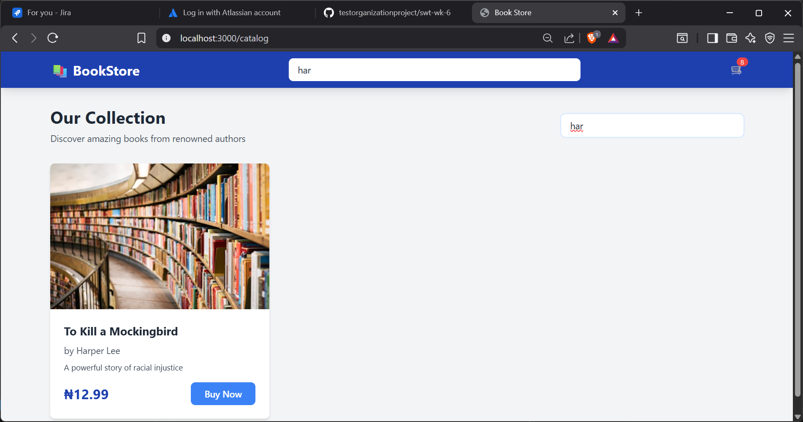
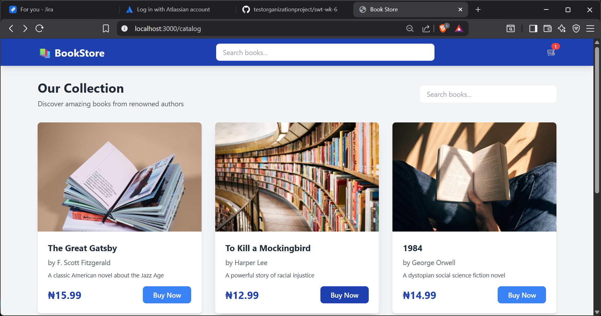
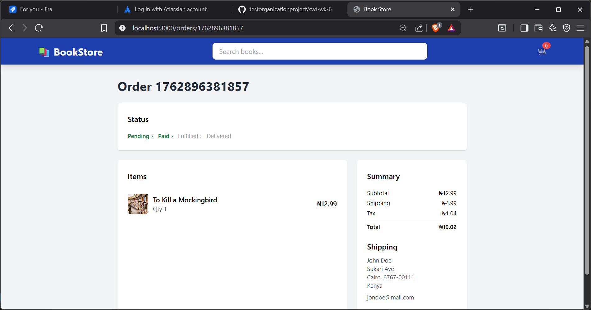
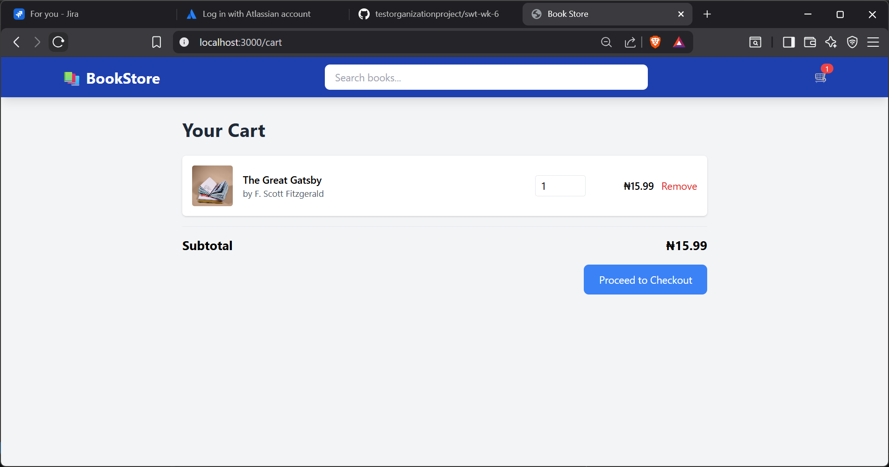
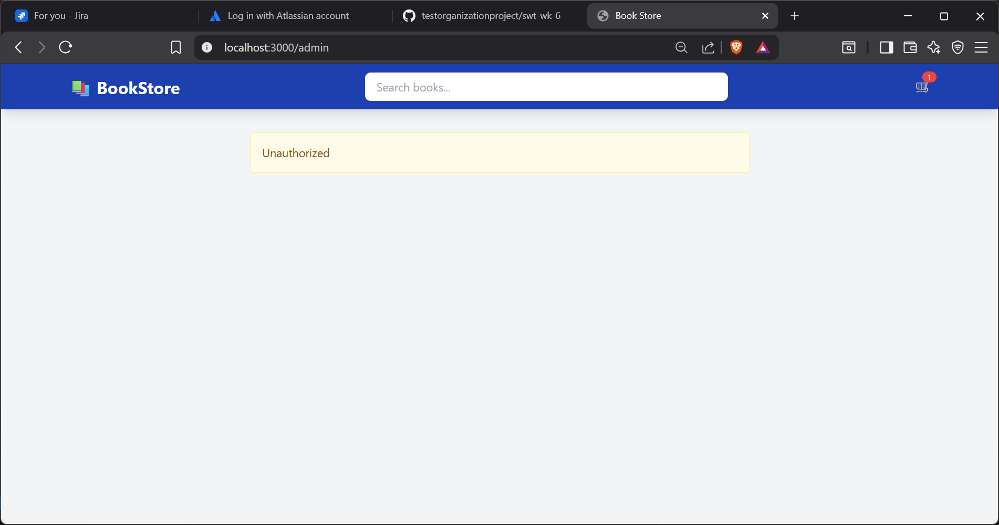

# ID: TC-SEARCH-01

Title: Verify books display after valid search

Pre-conditions: User is on the homepage or search page; book data exists in the database.

Steps:

1.Enter “Harper” in the search bar.
2.Click or press Enter to execute the search.

Expected Result: Books by or containing “Harper” appear in the results list with relevant metadata (title, author, price).

Post-conditions: Search results remain visible until the user clears or updates the query.

Evidence: 

# ID: TC-CART-01

Title: Verify adding an item increases cart badge count

Pre-conditions: User is logged in or guest session active; product catalog is displayed.

Steps:
1.Locate a product card.
2.Click “Add to Cart.”

Expected Result: Cart badge count increments by 1, and cart icon visually updates.

Post-conditions: Selected item is stored in cart (local storage or backend depending on implementation).

Evidence: 

# ID: TC-CHECKOUT-01

Title: Verify “Pay Now” completes with valid checkout data

Pre-conditions: User has at least one item in cart; valid payment and shipping data available.

Steps:
1.Proceed to checkout page.
2.Fill in required payment and address fields.

Click “Pay Now.”

Expected Result: Payment is processed successfully and confirmation message “Payment successful” displays.

Post-conditions: Cart is cleared; order record is created in system database.

Evidence: 

# ID: TC-STORAGE-01

Title: Verify cart persists after page reload (LocalStorage)

Pre-conditions: User has added at least one product to the cart.

Steps:
1.Add an item to cart.
2.Refresh or reopen the browser.

Expected Result: Previously added cart items reappear automatically upon reload.

Post-conditions: Cart state remains consistent in LocalStorage.

Evidence: 

# ID: TC-SECURITY-01

Title: Verify /admin route is inaccessible to non-admin users

Pre-conditions: User is logged in as a standard (non-admin) account.

Steps:
1.Attempt to manually visit /admin via browser URL.
2.Expected Result: User is redirected to /login or an “Access Denied” page; no admin data is exposed.

Post-conditions: Unauthorized access is logged; session remains intact.

Evidence: 

---------------------------------------------------------------------------------------------------

Checklist for Test Cases

| Checklist Item  | Description | Done |
|-----------|----------|----------|
| **Clear Objective**  | Each test case has a clear goal |  ☑ |  
| **Expected Outcome Defined**  | Pass/fail conditions explicit |  ☑ | 
| **Covers Valid & Invalid Inputs** | Includes edge and error cases |  ☑ | 
| **Simplicity** | Easy to understand and execute |  ☑ |  
| **Reusable Data** | Shared setup documented |  ☑ |   

